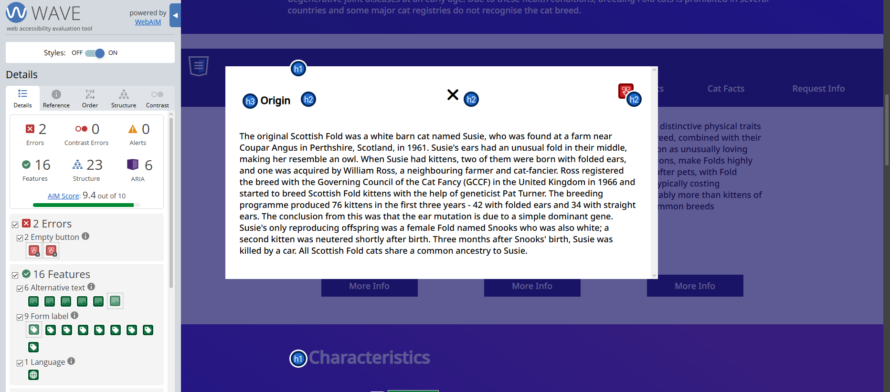

## Code Review Exercise

### Issue #1 - WAVE Report

    The first issue that I found was in fact an accessibility issue.
    The 2 errors that popped up were "2 empty buttons". This just means that
    the button is either empty or has no value. From this class, I learned
    that even buttons have value and that it should always have value. The
    solution to this error is the add an "aria-label" attribute. Caterina also
    mentioned that adding in a "title" attribute which will show the "title" of the
    image as a tolltip when the user hoovers over the image.

    

    Inital code:
    ```html

<button class="close-popup-button">
        <i class="fa-solid fa-xmark"></i>
    </button>
    ```
    html
    updated code:
<button
        class="close-popup-button"
        title="close-popup-button"
        aria-label="close popup button"
        >
        <i class="fa-solid fa-xmark"></i>
    </button>
    ```

### Issue #2 - Nav Bar

    The second issue is that the small-screen navbar opnes but it does not close after clicking a link. The mobile navbar uses a hidden checkbox to open the menu:
    Initial Code:
    ```
    html

<label
for="navbar-toggle-trigger"
id="navbar-toggle-expand-button"
class="navbar-circular-icon-button"
aria-label="open navbar list"

> <i class="fa-solid fa-bars"></i>
> </label>

        ```

The CSS shows the menu when that checkbox is checked:
Initial Code:
```
CSS
.navbar-toggle-trigger {
display: none;
}

.navbar-toggle-trigger:checked ~ .small-screen-navbar-element-container {
display: block;
}

````
    That means that the hamburger menu technically works. It does open on small screens. But when a user clicks one of the navbar links, the checkbox stays checked so the menu remains open and can cover the entire page. That makes this navbar feel broken on a mobile screen.
    Here is the solution (I Think)

    A simple fix to this is to add another label inside the open menu that points to the same checkbox. Clicking it will uncheck the checkbox and close the menu.
    Updated Code:
    ```
html
<div
  id="small-screen-navbar-element-container"
  class="small-screen-navbar-element-container"
>
  <label
    for="navbar-toggle-trigger"
    class="navbar-toggle-close-button"
    aria-label="close navbar list"
  >
    <i class="fa-solid fa-xmark"></i>
  </label>

  <ul class="nav-list">
    ...
  </ul>
</div>
````

### Issue #3 - Form

    The third issue is within the form but its the button at the bottom. The submit and the reset button. I am not able to reset the form nor is it submitting anything. Thats because the current code:
    Inital Code:
    ```
    HTML
     </form>
      <div
        class="form space-evenly-distributed-row-container form-buttons-container"
      >
        <input class="form-button" type="submit" value="submit" />
        <input class="form-button" type="reset" value="reset" />
    ```
    has the buttons on the outside of the entire <form> class. So the solution to this is to put the 3 lines inside of it like this:
    Updated Code:
    ```
    HTML
      <div
        class="form space-evenly-distributed-row-container form-buttons-container"
      >
        <input class="form-button" type="submit" value="submit" />
        <input class="form-button" type="reset" value="reset" />
    </form>
    ```

This simple fix is to move the button container inside of the form. So even though the form is visually correct, the form behavior is broken.
